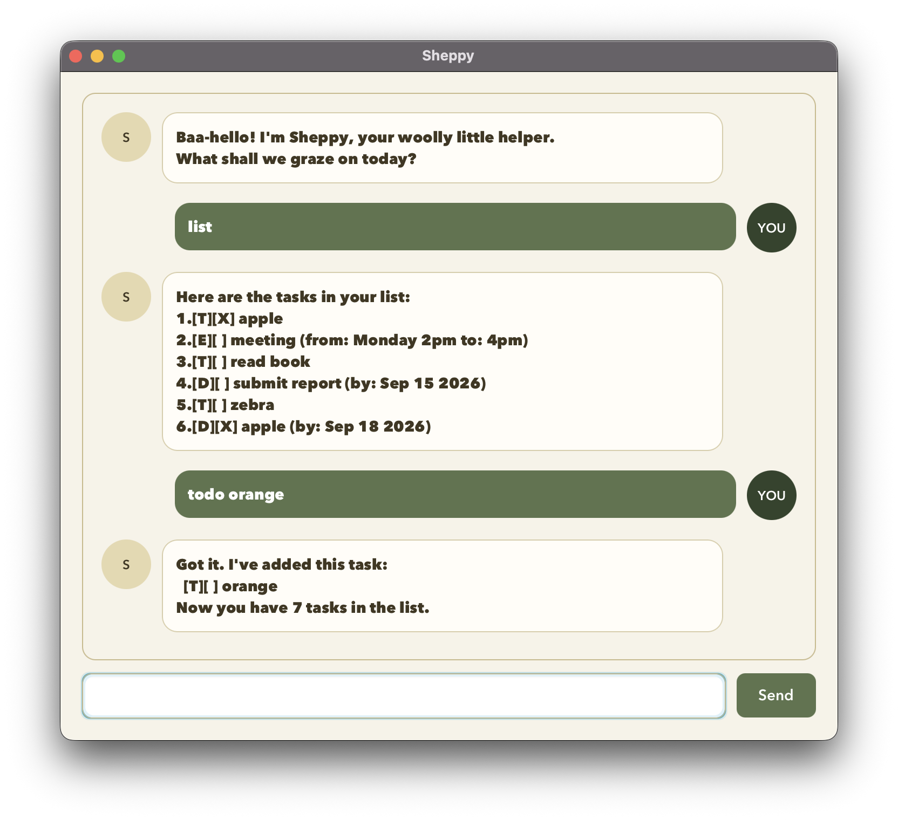

# Sheppy User Guide



Sheppy is your woolly task helper: a desktop chat app for todos, deadlines
and events. Enter a command and press **Enter** or click **Send**.

## Getting started

1. Install **Java 25**. Check your terminal's version with `java -version`.
2. Download `sheppy.jar` from the assets of the
   [latest release](https://github.com/yukemii/ip/releases/latest).
3. Place it in a folder where you can save files. Open a terminal in that folder.
4. Run `java -jar sheppy.jar` to open the chat window.

Keep launching from the same folder: Sheppy saves to `data/tasks.txt` relative
to your terminal's working folder. No internet connection is needed after download.
The JAR bundles JavaFX for Windows/Linux x64 and Intel/Apple Silicon Macs;
other CPU architectures are not bundled. Java must be installed separately.

## Command basics

- Command names are lowercase. Do not type the backticks used in this guide.
- Replace uppercase placeholders with your own text; descriptions can contain spaces.
- Leading/trailing whitespace is ignored; repeated spaces and tabs become one space.
- Do not use `|` in task details: it is reserved for saving data.
- Use each date/time marker once and in the order shown.
- `[T]`, `[D]` and `[E]` mean todo, deadline and event. `[ ]` means unfinished;
  `[X]` means done.

## Adding todos

Format: `todo DESCRIPTION`. A todo has no attached date or time.

```text
todo borrow book
```

Sheppy confirms `[T][ ] borrow book` and displays the new task count.

## Adding deadlines

Format: `deadline DESCRIPTION /by yyyy-MM-dd`.

```text
deadline return book /by 2026-09-18
```

This displays `[D][ ] return book (by: Sep 18 2026)`.
Use a real calendar date in year-month-day format. February 30, `Friday`,
and `18/09/2026` are rejected. Deadlines do not support times of day.

## Adding events

Format: `event DESCRIPTION /from START /to END`.

```text
event project meeting /from Monday 2pm /to Monday 4pm
```

This displays `[E][ ] project meeting (from: Monday 2pm to: Monday 4pm)`.
Event times are free-form text, unlike deadline dates. Sheppy does not check
whether the end is after the start; check these details yourself.

## Viewing tasks

`list` shows all tasks in their current order, including completed tasks.
After adding the examples above, the entries are:

```text
1.[T][ ] borrow book
2.[D][ ] return book (by: Sep 18 2026)
3.[E][ ] project meeting (from: Monday 2pm to: Monday 4pm)
```

An empty list shows the heading without task entries.

## Finding tasks

Format: `find KEYWORD`. Example: `find book` matches both book tasks above.
Search is **case-sensitive** and matches substrings or phrases in descriptions,
not dates or event times. It does not change your tasks. If nothing matches:

```text
No matching tasks found. Try another keyword!
```

**Important:** search results have their own numbering. Before marking or
deleting, run `list` and use the number from the full list, not from `find`.

## Marking and unmarking

`mark NUMBER` marks a task done; `unmark NUMBER` makes it unfinished again.

```text
mark 1
unmark 1
```

The task's status changes to `[X]` and back to `[ ]`; the task is not removed.
Numbers start at 1 and must refer to an existing task in the full list.

## Deleting tasks

`delete NUMBER` removes the specified task. For example, `delete 3` removes
the third task and displays the removed entry and remaining count.
Later tasks are renumbered. **There is no undo command**: check `list` first,
and re-add a task if you delete it by mistake.

## Sorting tasks

`sort` orders all tasks alphabetically by description, ignoring letter case,
and saves the new order. It does not sort by date or completion status.
Descriptions differing only in letter case use case-sensitive ordering to
break ties. An empty list can also be sorted.

Numbers can change after sorting. Use `list` before your next numbered command.

## Exiting

`bye` shows a farewell and closes the window shortly afterward. You can also
close the window normally: successful changes are saved immediately, not only on exit.

## Saving and recovering tasks

Additions, deletions, status changes and sorting are saved automatically.
Restart from the same working folder to load them; no save command is needed.

- **First launch:** a missing file is normal. Sheppy starts empty and creates
  `data/tasks.txt` when saving a change.
- **Backup:** close Sheppy and copy `data/tasks.txt` somewhere safe. Restore
  that copy while Sheppy is closed, then restart.
- **Save error:** the attempted change is rolled back. Check write permission
  and disk space, then retry. Saving requires atomic file replacement;
  use a normal local folder if your filesystem does not support it.
- **Load error:** Sheppy reports the problem and blocks changes to protect
  existing data. Back up and repair the file, then restart. The empty displayed
  list after a load error does not mean your saved data was deleted.
- **Start fresh:** close Sheppy, move the task file to a backup location, and
  restart. Only do this if you want an empty list.

Do not run multiple instances using the same file or edit it while Sheppy is
running. Saving to symbolic-link task files is not supported.

## Troubleshooting

| Problem | What to do |
| --- | --- |
| Java not found or a Java version error | Install/select Java 25; check with `java -version`. |
| JAR not found | Navigate to its folder and use its exact filename. |
| `Baa-error:` response | Read the explanation, correct the command and retry. Invalid commands do not change tasks. |
| Invalid task number | Use `list`, then choose an existing positive whole number. |
| Tasks missing after restart | Check your working folder and any load-error message. |
| GUI fails to start | Run from the terminal to see the error; check Java 25 and your OS/CPU architecture. |

## Command summary

```text
todo DESCRIPTION
deadline DESCRIPTION /by yyyy-MM-dd
event DESCRIPTION /from START /to END
list
find KEYWORD
mark NUMBER
unmark NUMBER
delete NUMBER
sort
bye
```
